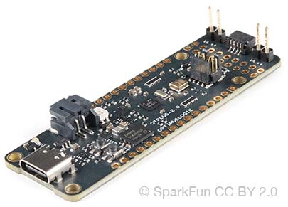
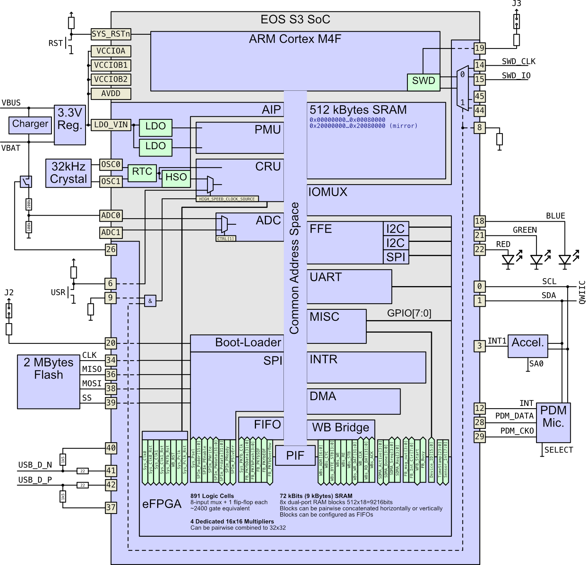

# Get Started With SparkFun QuickLogic Thing Plus - EOS S3

Do you want to play with the QuickLogic EOS S3 MCU + eFPGA SoC on the new Thing+ board from SparkFun? Are you tired of poor PDF documentation and confusing SDKs? This project might be something for you.

The goal of this project is to document registers and functions of the SoC and the board in a VSCode friendly way and to provide bare-bones startup code for tinkering.
There are no references to any SDKs or libraries other than the stock [GNU Arm Embedded Toolchain](https://developer.arm.com/tools-and-software/open-source-software/developer-tools/gnu-toolchain/gnu-rm/downloads). There is no build system other than a simple Makefile. The code is kept as simple, small, and clear as possible.

To get started, have the [GNU Arm Embedded Toolchain](https://developer.arm.com/tools-and-software/open-source-software/developer-tools/gnu-toolchain/gnu-rm/downloads) installed, type `make`, and load the compiled `main.elf` or `main.bin` to the device via JLink or other means. The main program activates an UART (115200 8N1) on pads 44 and 45. A simple CLI provides various functions, including reading the accelerometer, ADC, and USR button; writing itself into flash memory, and configuring the FPGA.

The FPGA designs are included in this project as design files and ready-to-use synthesized bitstreams. By default, `make` simply includes the bitstream data in the firmware and the main program will configure the FPGA during runtime. If you want to change the design and re-sythesize, install [QuickLogic's Symbiflow fork](https://github.com/QuickLogic-Corp/quicklogic-fpga-toolchain/) and type `make hw`.

A simplified (and rather incomplete) overview of the board and its EOS S3 SoC is shown here:

It is very much a work-in-progress. For now, only the most basic definitions are included. I'll be adding information as a learn more about this device. Feel free to send me PRs for the parts you care about.

## Quick Links

* [SparkFun Product Page](https://www.sparkfun.com/products/17273)
  * [Hookup Guide](https://learn.sparkfun.com/tutorials/quicklogic-thing-plus-eos-s3-hookup-guide)
* [QuickLogic SDK with FreeRTOS](https://github.com/QuickLogic-Corp/qorc-sdk)
  * [SDK Documentation](https://qorc-sdk.readthedocs.io/en/latest/)
* [S3 Technical Reference Manual](https://www.quicklogic.com/wp-content/uploads/2020/06/QL-S3-Technical-Reference-Manual.pdf)
* [S3 Datasheet](https://www.quicklogic.com/wp-content/uploads/2020/12/QL-EOS-S3-Ultra-Low-Power-multicore-MCU-Datasheet-2020.pdf)
* [S3 Interrupt Manual](https://www.quicklogic.com/wp-content/uploads/2020/11/QuickLogic-S3-Interrupt-FINAL.pdf)
* [S3 Register Description Excel Sheet](https://github.com/QuickLogic-Corp/EOS-S3/blob/master/Docs/EOSS3-Registers.xlsx)

